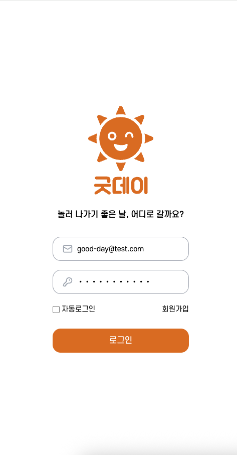
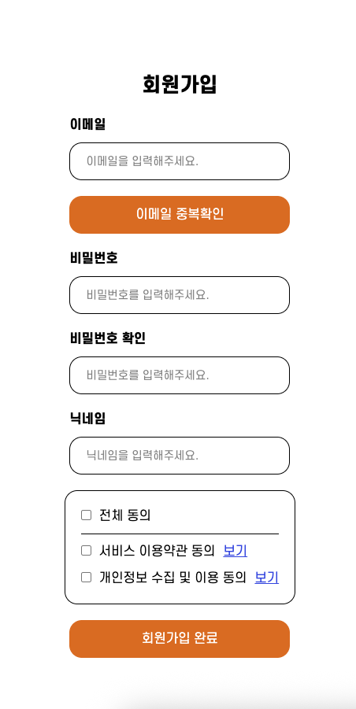
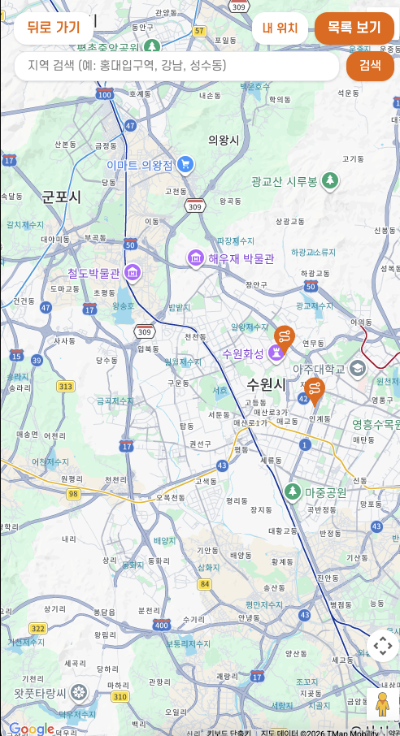
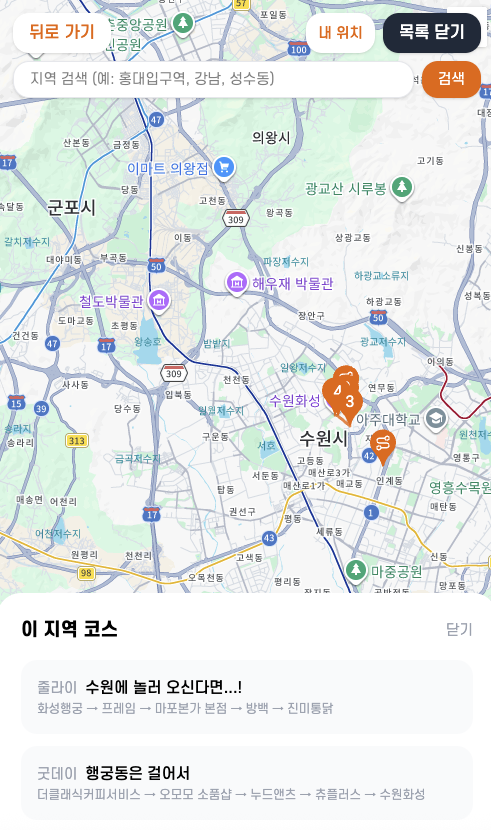
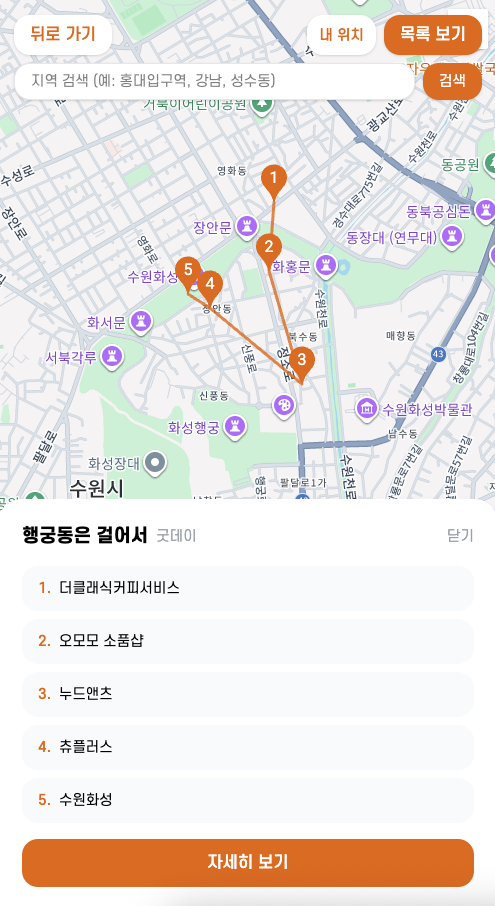
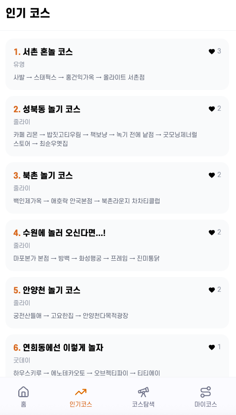
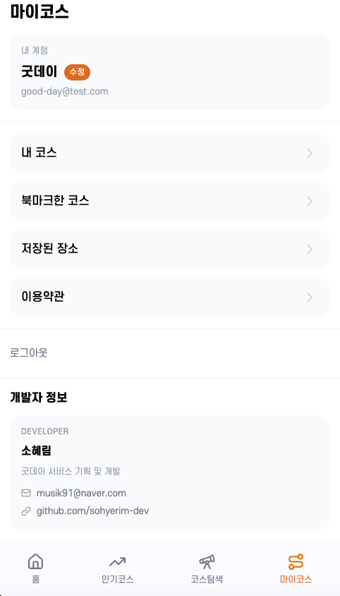

<div align="center">
  
</div>

# 굿데이 (Good Day)

> 나만의 놀기 코스 플래너 — 장소 검색부터 경로 안내, 코스 공유까지


🔗 **배포 주소:** https://good-day-rose.vercel.app

**테스트 계정**

- 이메일: `good-day@test.com`
- 비밀번호: `goodday1234`

---

## 프로젝트 개요

친구들과 놀러 나갈 코스를 직접 만들고 공유할 수 있는 웹 서비스입니다.

장소를 검색해 코스에 추가하고, 드래그로 순서를 바꾸고, 완성된 코스의 이동 경로를 지도로 확인할 수 있습니다. 만든 코스는 URL 링크로 공유하거나 카카오톡 등 메신저로 OG 미리보기와 함께 전달할 수 있습니다.

### 주요 기능

| 기능       | 설명                                                     |
| ---------- | -------------------------------------------------------- |
| 코스 생성  | 네이버 장소 검색 후 원하는 장소 추가, 드래그로 순서 변경 |
| 코스 공유  | URL 복사, OG 메타 지원 (카카오톡 등 미리보기)            |
| 경로 보기  | Google Maps 기반 도보·대중교통 경로 안내                 |
| 코스 탐색  | 지도에서 주변 코스 탐색, 지역명으로 검색                 |
| 인기 코스  | 좋아요 수 기준 공개 코스 랭킹                            |
| 마이코스   | 내가 만든 코스, 북마크한 코스, 저장된 장소 관리          |
| 자동로그인 | 체크 여부에 따라 세션 유지 방식 선택 가능                |

---

## 기술 스택

### Frontend

| 항목      | 기술                    |
| --------- | ----------------------- |
| Framework | Next.js 16 (App Router) |
| Language  | TypeScript              |
| Styling   | Tailwind CSS v4         |
| State     | Zustand v5              |
| DnD       | @dnd-kit                |

### Backend / Infra

| 항목      | 기술                                        |
| --------- | ------------------------------------------- |
| BaaS      | Supabase (Auth + PostgreSQL + RLS)          |
| 지도      | Google Maps API (@vis.gl/react-google-maps) |
| 장소 검색 | 네이버 검색 API                             |
| 지역 검색 | Google Geocoding API                        |
| 배포      | Vercel                                      |

---

## 데이터베이스 구조

Supabase PostgreSQL을 사용하며, 모든 테이블에 Row Level Security(RLS) 정책이 적용되어 있습니다.

```
profiles
├── id          uuid (auth.users 참조)
└── username    text

courses
├── id          uuid
├── user_id     uuid (profiles 참조)
├── title       text
├── description text
├── is_public   boolean
├── course_lat  float (코스 중심 위도)
└── course_lng  float (코스 중심 경도)

places
├── id          uuid
├── name        text
├── address     text
├── lat         float
├── lng         float
└── naver_url   text (unique)

course_places
├── id          uuid
├── course_id   uuid (courses 참조)
├── place_id    uuid (places 참조)
└── order       int

likes
├── id          uuid
├── user_id     uuid
└── course_id   uuid

bookmarks
├── id          uuid
├── user_id     uuid
└── course_id   uuid

saved_places
├── id          uuid
├── user_id     uuid
└── place_id    uuid
```

---

## 페이지 및 기능 소개

### 로그인 · 회원가입

이메일과 비밀번호로 로그인하며, 자동로그인 옵션을 선택할 수 있습니다. 자동로그인을 해제하면 새 탭·새 창에서는 세션이 유지되지 않습니다.

| 로그인                                                         | 회원가입                                                          |
| -------------------------------------------------------------- | ----------------------------------------------------------------- |
|  |  |

---

### 홈

내가 만든 코스 목록을 확인하고, 코스 상세페이지로 이동할 수 있습니다.


---

### 코스 만들기

네이버 장소 검색으로 원하는 장소를 추가하고, 드래그 앤 드롭으로 방문 순서를 자유롭게 조정할 수 있습니다. 저장된 장소 목록에서 바로 불러오는 것도 가능합니다. 제목을 입력하지 않으면 닉네임과 날짜·시간이 자동으로 제목이 됩니다.


---

### 코스 상세

코스에 포함된 장소 목록을 확인하고, 경로 보기·교통수단 보기·공유·좋아요·북마크 기능을 이용할 수 있습니다. URL을 복사해 공유하면 카카오톡 등에서 OG 미리보기(제목·설명·이미지)가 표시됩니다.


---

### 경로 보기

Google Maps 기반으로 코스 장소들 간의 도보 또는 대중교통 경로를 순서대로 안내합니다.

| 도보 경로                                                         | 대중교통 경로                                                           |
| ----------------------------------------------------------------- | ----------------------------------------------------------------------- |
|  |  |

---

### 코스 탐색

지도에서 현재 화면 영역 내의 코스를 탐색할 수 있습니다. 코스 시작 장소에 마커가 표시되며, 마커를 클릭하면 코스 정보와 장소 목록을 확인할 수 있습니다. 지역명으로 지도를 이동하는 검색 기능도 제공합니다.

| 지도 탐색                                                             | 목록 보기                                                             | 마커 클릭                                                             |
| --------------------------------------------------------------------- | --------------------------------------------------------------------- | --------------------------------------------------------------------- |
|  |  |  |

---

### 인기 코스

좋아요 수를 기준으로 공개된 코스를 순위별로 보여줍니다.



---

### 마이코스

프로필 닉네임 수정, 내가 만든 코스·북마크한 코스·저장된 장소를 한곳에서 관리할 수 있습니다.



---

## 느낀점 & 아쉬운점

### 느낀점

직접 코드를 작성하고 흐름을 하나씩 이해해가는 과정이 가장 인상 깊었습니다. Google Maps API, 네이버 장소 검색 API 등 외부 API를 직접 연동하면서 인증 방식, CORS 처리, 서버·클라이언트 환경 차이 등 실무에서 마주치는 문제들을 경험할 수 있었습니다.

### 아쉬운점

- **React Query 미활용** — `@tanstack/react-query`를 설치했지만 실제로는 `useEffect`로 직접 fetch 처리. 서버 상태 캐싱·동기화를 더 체계적으로 구성할 수 있었을 것 같습니다. (개선 예정)
- **에러·로딩 처리 일관성 부족** — 페이지마다 에러·로딩 UI가 제각각이라 통일된 패턴이 없습니다. (개선 예정)
- **테스트 코드 부재** — 단위 테스트나 E2E 테스트 없이 수동으로만 확인했습니다. (개선 예정)
- **페이지네이션 없음** — 코스·장소가 많아질 경우 성능 문제가 발생할 수 있습니다. (개선 예정)

---

## 트러블슈팅

### useSearchParams() Next.js 빌드 오류

**증상** `Error occurred prerendering page "/login"` — Vercel 빌드 실패

**원인** `useSearchParams()`를 사용하는 컴포넌트가 `<Suspense>` 없이 정적 프리렌더링 대상이 되면 빌드 단계에서 오류가 발생

**해결** 로그인 폼을 `LoginForm.tsx` 클라이언트 컴포넌트로 분리하고, `page.tsx`에서 `<Suspense>`로 래핑

---

### 경로 일부만 표시되는 문제

**증상** 여러 구간 경로 중 마지막 구간만 렌더링됨

**원인** `for` 루프로 순차 fetch하는 과정에서 React Strict Mode의 이중 실행과 cleanup 타이밍이 겹쳐 앞선 구간 렌더링이 취소됨

**해결** `Promise.all`로 전체 구간을 병렬 fetch하고, `cancelled` 플래그로 cleanup 시 렌더링을 중단하도록 처리

---

### 코스 수정 시 장소 중복 삽입

**증상** 코스 편집 저장 시 장소가 중복으로 생성됨

**원인** `course_places` 테이블에 DELETE RLS 정책이 없어 기존 장소 삭제가 무시되고 새 장소만 삽입됨

**해결** Supabase에서 DELETE 정책 추가 (`courses.user_id = auth.uid()` 조건)

---

### 공유 URL 로그인 후 홈으로 이동

**증상** 공유된 코스 링크를 새 탭에서 열면 로그인 후 해당 코스가 아닌 홈(`/`)으로 이동

**원인** `AuthProvider`에서 새 탭 감지 시 signOut 후 `router.push("login")`(슬래시 없는 상대경로)을 호출 → `/courses/login`으로 이동 → redirect 파라미터 없이 `/login`으로 재리다이렉트 → 로그인 후 기본값 `/`로 이동

**해결** `router.push("/login?redirect=" + encodeURIComponent(pathname))`으로 수정해 로그인 후 원래 페이지로 복귀

---

### 코스 상세 OG 메타 미적용

**증상** 코스 링크를 카카오톡 등에 공유해도 기본 OG 이미지·제목만 표시됨

**원인** `generateMetadata`는 서버에서 실행되어 브라우저 쿠키 기반 Supabase 클라이언트를 사용할 수 없고, anon 키로 REST API를 직접 호출했으나 SELECT RLS 정책이 `authenticated` 역할만 허용해 데이터 조회가 차단됨

**해결** Supabase SELECT 정책에 `anon` 역할 추가 (`ALTER POLICY ... TO authenticated, anon`)

---

## 페이지 구조

```
app/
├── (auth)
│   ├── login          # 로그인
│   └── signup         # 회원가입
│
├── (main)                        # 하단 네비게이션 포함
│   ├── /                         # 홈 — 내 코스 목록
│   ├── hot                       # 인기 코스 (좋아요 순 랭킹)
│   ├── create                    # 코스 만들기
│   ├── courses/[id]              # 코스 상세
│   ├── courses/[id]/edit         # 코스 수정
│   └── my-course                 # 마이코스
│       ├── /                     # 프로필 · 설정
│       ├── courses               # 내가 만든 코스
│       ├── bookmarks             # 북마크한 코스
│       ├── saved-places          # 저장된 장소
│       └── terms                 # 이용약관
│
└── (fullscreen)                  # 하단 네비게이션 없음
    ├── explore                   # 코스 탐색 (지도)
    └── map/[id]                  # 경로 보기 (Google Maps)
```

---

## 로컬 실행

```bash
# 패키지 설치
npm install

# 환경변수 설정 (.env.local)
NEXT_PUBLIC_SUPABASE_URL=
NEXT_PUBLIC_SUPABASE_ANON_KEY=
NEXT_PUBLIC_GOOGLE_MAPS_API_KEY=
NAVER_CLIENT_ID=
NAVER_CLIENT_SECRET=

# 개발 서버 실행
npm run dev
```
