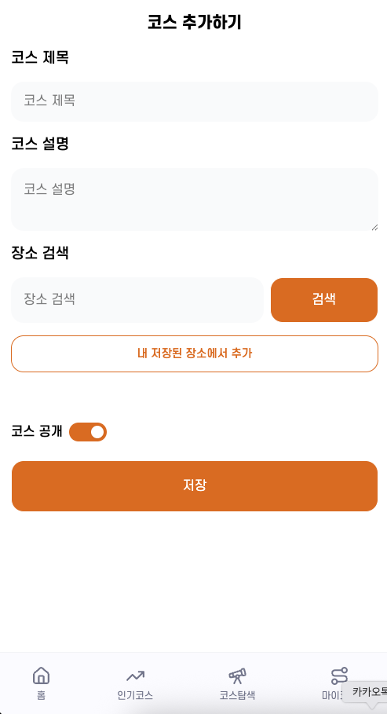
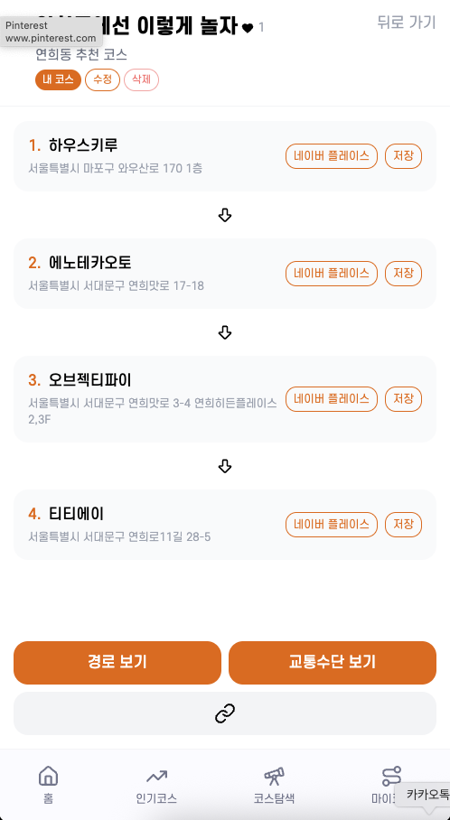
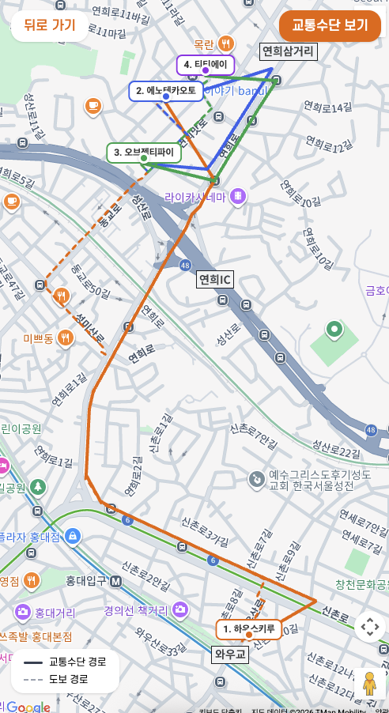
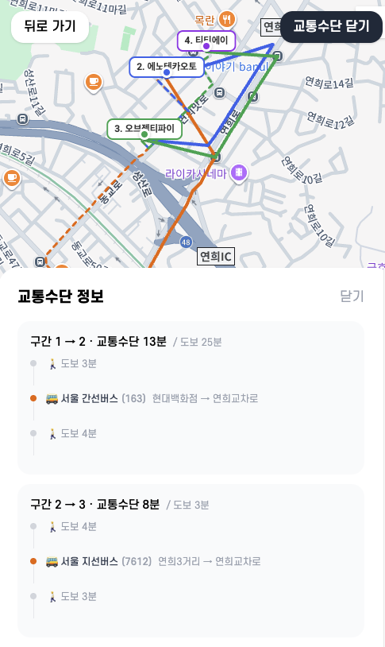
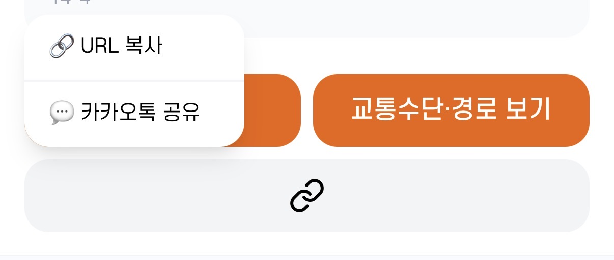
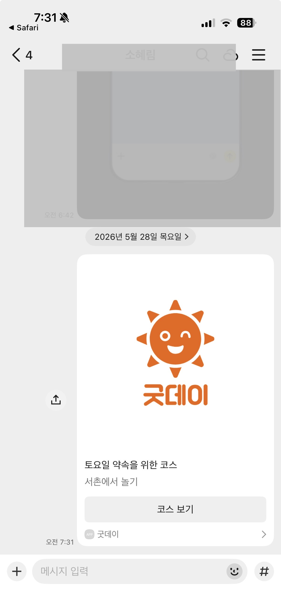

<div align="center">
  
</div>

# 굿데이 (Good Day)

> 내 취향대로 짜는 놀기 코스 플래너


🔗 **배포 주소:** https://www.good-day-out.com

**테스트 계정**

- 이메일: `good-day@test.com`
- 비밀번호: `goodday1234`

---

## 프로젝트 소개

계획형 인간인 J로서, 약속이나 여행 전 장소와 동선부터 정해야 직성이 풀린다.
그렇다면 엑셀 대신 코스를 직접 만들 수 있는 서비스를 만들어보자!

장소 검색, 코스 구성, 이동 경로 확인, 친구와 공유까지 한 곳에서 할 수 있는 웹 서비스입니다.

---

## 기술 스택

### Frontend

| 항목          | 기술                              |
| ------------- | --------------------------------- |
| Framework     | Next.js 16 (App Router)           |
| Language      | TypeScript                        |
| Styling       | Tailwind CSS v4                   |
| 전역 상태     | Zustand v5                        |
| 서버 상태     | TanStack React Query v5           |
| DnD           | @dnd-kit                          |

### Backend / Infra

| 항목      | 기술                                        |
| --------- | ------------------------------------------- |
| BaaS      | Supabase (Auth + PostgreSQL + RLS)          |
| 지도      | Google Maps API (@vis.gl/react-google-maps) |
| 경로 안내 | TMap API                                    |
| 장소 검색 | 네이버 검색 API                             |
| 지역 검색 | Google Geocoding API                        |
| 배포      | Vercel                                      |

---

## 핵심 구현 기능

- ✅ 네이버 장소검색 API 기반 장소 검색 및 코스 추가 기능 구현
- ✅ Google Maps API / TMap API 연동을 통한 도보·대중교통 경로 안내 기능 구현
- ✅ Drag & Drop 기반 방문 순서 변경 UI 구현
- ✅ Supabase Auth 및 Database 기반 사용자 인증·데이터 관리 구현
- ✅ Row Level Security(RLS)를 적용해 사용자별 데이터 접근 제어 구성
- ✅ Zustand 기반 전역 상태 관리 및 코스 생성 흐름 상태 관리
- ✅ OG 메타데이터 적용을 통한 공유 미리보기 기능 구현
- ✅ React Query 기반 서버 상태 캐싱 및 낙관적 업데이트 구현
- ✅ Google Maps API 연동 지도 기반 주변 코스 탐색 기능 구현 (뷰포트 내 코스·장소 실시간 필터링)
- ✅ 좋아요 기반 인기 코스 랭킹 및 북마크·저장 장소 관리 기능 구현

---

## 핵심 사용자 흐름

### 코스 추가하기 — 장소 검색 및 추가



- 원하는 장소를 검색해 추가하고, 드래그 앤 드롭으로 순서를 변경할 수 있어요.
- 코스를 공개 설정하면 코스 탐색에서 다른 사용자에게 보여요.

---

### 코스 저장 및 확인



- 내가 만든 코스를 한눈에 확인할 수 있어요.
- 네이버 플레이스와 연결해 장소 정보를 바로 확인할 수 있어요.

---

### 경로 보기 + 교통수단 보기

| 도보 경로                                                         | 대중교통 경로                                                           |
| ----------------------------------------------------------------- | ----------------------------------------------------------------------- |
|  |  |

- 내가 만든 코스의 도보 경로와 교통수단 경로를 확인할 수 있어요.
- 구간별 최적 경로와 예상 소요 시간을 한눈에 확인할 수 있어요.

---

### 친구에게 공유하기 — URL / 카카오톡 공유

| URL/카카오톡 공유                                                              | 카카오톡 미리보기                                                              |
| ------------------------------------------------------------------------------ | ------------------------------------------------------------------------------ |
|  |  |

- 내가 만든 코스를 친구에게 공유할 수 있어요.
- 공유받은 친구는 코스 정보와 경로를 확인할 수 있어요.

---

## Production 서비스 운영

🔗 **운영 주소:** https://good-day-go-out.co.kr

| 지표         | 수치     |
| ------------ | -------- |
| Visitors     | 1,700+   |
| Page Views   | 7,500+   |
| 가입 사용자  | 150+     |

- 서비스 공개 후 실제 사용자 유입 발생
- SNS 홍보를 통해 사용자 피드백 수집
- 사용자 행동 기반 기능 개선 진행

---

## 사용자 피드백 기반 개선

### ✅ 회원 탈퇴 기능 추가
- 실제 서비스 운영을 고려해 회원 탈퇴 기능 추가
- 사용자 데이터 및 계정 관리 기능 보완

### ✅ 장소별 메모 기능 추가
- 사용자 피드백을 반영해 장소별 메모 기능 추가
- 일반 메모와 시간 메모를 각각 작성 및 공유 가능하도록 개선

### ✅ 친구와 공동 편집 기능 추가
- 함께 여행 코스를 수정하고 싶다는 사용자 요청 반영
- 초대 링크를 통해 공동 편집 가능하도록 구현

### ✅ 해외 장소 검색 기능 추가
- 해외 여행 및 해외 거주 사용자 대응을 위해 기능 확장
- Google Places API를 추가 연동하여 해외 장소 검색 지원

### ✅ PWA 적용
- 앱처럼 사용하고 싶다는 사용자 니즈 반영
- Web App Manifest 적용 / 홈 화면 추가 및 standalone 모드 지원

### ✅ 코스 탐색 필터 개선
- 서비스 운영 정책 및 사용자 제어를 위해 개선
- 인기 코스 및 코스 탐색에 `is_hidden` 필터 적용

### ✅ 경로 미리보기 기능 추가
- 코스 추가 및 수정 과정에서 경로를 미리 확인 가능하도록 개선
- 장소 순서를 변경하며 동선을 직관적으로 확인 가능

---

## 트러블슈팅

### useSearchParams() Next.js 빌드 오류

**증상** `Error occurred prerendering page "/login"` — Vercel 빌드 실패

**원인** `useSearchParams()`를 사용하는 컴포넌트가 `<Suspense>` 없이 정적 프리렌더링 대상이 되면 빌드 단계에서 오류가 발생

**해결** 로그인 폼을 `LoginForm.tsx` 클라이언트 컴포넌트로 분리하고, `page.tsx`에서 `<Suspense>`로 래핑

---

### 모바일에서 드래그 앤 드롭 순서 변경 불가

**증상** 코스 추가·편집 화면에서 장소 순서를 드래그로 변경하려 하면 스크롤만 발생하고 드래그가 동작하지 않음. 드래그 핸들(이미지)을 길게 누르면 이미지가 새 탭으로 열리는 현상도 발생

**원인**
- `@dnd-kit/core`는 기본적으로 마우스 이벤트를 처리하는 `PointerSensor`만 사용하는데, 모바일의 터치 이벤트는 스크롤과 동일한 방식으로 인식되어 구분하지 못함
- 드래그 핸들 영역에 이미지(``)가 있으면 모바일 브라우저가 길게 누르는 동작을 "이미지 저장/새 탭 열기" 팝업으로 먼저 가로챔
- CSS `touch-action`이 설정되지 않으면 드래그가 시작된 이후에도 브라우저가 해당 터치를 스크롤로 재해석해 드래그가 중단됨

**해결**
- `DndContext`에 `TouchSensor`를 추가해 터치 이벤트를 별도로 처리하고, `activationConstraint`로 `delay: 250`, `tolerance: 5` 설정
- 드래그 핸들 요소에 `touch-action: none` 적용
- 이미지 요소에 `draggable={false}`, `pointer-events: none` 적용
- `onContextMenu` preventDefault 및 `-webkit-touch-callout: none` 적용으로 iOS/Android 팝업 차단

---

### 경로 일부만 표시되는 문제

**증상** 여러 구간 경로 중 마지막 구간만 렌더링됨

**원인** `for` 루프로 순차 fetch하는 과정에서 React Strict Mode의 이중 실행과 cleanup 타이밍이 겹쳐 앞선 구간 렌더링이 취소됨

**해결** `Promise.all`로 전체 구간을 병렬 fetch하고, `cancelled` 플래그로 cleanup 시 렌더링을 중단하도록 처리

---

### 코스 수정 시 장소 중복 삽입

**증상** 코스 편집 저장 시 장소가 중복으로 생성됨

**원인** `course_places` 테이블에 DELETE RLS 정책이 없어 기존 장소 삭제가 무시되고 새 장소만 삽입됨

**해결** Supabase에서 DELETE 정책 추가 (`courses.user_id = auth.uid()` 조건)

---

### 공유 URL 로그인 후 홈으로 이동

**증상** 공유된 코스 링크를 새 탭에서 열면 로그인 후 해당 코스가 아닌 홈(`/`)으로 이동

**원인** `AuthProvider`에서 새 탭 감지 시 signOut 후 `router.push("login")`(슬래시 없는 상대경로)을 호출 → `/courses/login`으로 이동 → redirect 파라미터 없이 `/login`으로 재리다이렉트 → 로그인 후 기본값 `/`로 이동

**해결** `router.push("/login?redirect=" + encodeURIComponent(pathname))`으로 수정해 로그인 후 원래 페이지로 복귀

---

### 코스 상세 OG 메타 미적용

**증상** 코스 링크를 카카오톡 등에 공유해도 기본 OG 이미지·제목만 표시됨

**원인** `generateMetadata`는 서버에서 실행되어 브라우저 쿠키 기반 Supabase 클라이언트를 사용할 수 없고, anon 키로 REST API를 직접 호출했으나 SELECT RLS 정책이 `authenticated` 역할만 허용해 데이터 조회가 차단됨

**해결** Supabase SELECT 정책에 `anon` 역할 추가 (`ALTER POLICY ... TO authenticated, anon`)

---

## 회고

### 단순 구현이 아닌, 실제 서비스 운영 경험
부트캠프에서는 주어진 요구사항을 구현하는 경험이 중심이었다면, 이번 프로젝트에서는 실제 사용자가 사용하는 서비스를 직접 운영하며 개발 이후의 과정까지 경험할 수 있었습니다.

### 사용자 관점과 개발자 관점의 차이 경험
초기에는 "코스를 저장하고 공유할 수 있으면 충분하다"고 생각했지만, 실제 사용자들은 공동 편집, 장소별 메모, 경로 미리보기 기능을 더 필요로 했습니다. 이를 통해 개발자가 중요하다고 생각한 기능과 사용자가 실제로 원하는 기능 사이에는 차이가 존재할 수 있다는 점을 배울 수 있었습니다.

### 다양한 환경과 운영까지 고려하는 프론트엔드 경험
모바일 환경에서는 터치 UX와 스크롤 충돌 문제를 직접 해결해야 했고, 서비스 운영 과정에서는 공개 코스 관리와 사용자 제어 기능의 필요성을 경험했습니다. 프론트엔드 개발은 단순 UI 구현이 아니라, 다양한 환경의 사용자 경험과 서비스 운영까지 함께 고려해야 한다는 점을 체감할 수 있었습니다.

---

## 페이지 구조

```
app/
├── (auth)
│   ├── login          # 로그인
│   └── signup         # 회원가입
│
├── (main)                        # 하단 네비게이션 포함
│   ├── /                         # 홈 — 내 코스 목록
│   ├── hot                       # 인기 코스 (좋아요 순 랭킹)
│   ├── create                    # 코스 만들기
│   ├── courses/[id]              # 코스 상세
│   ├── courses/[id]/edit         # 코스 수정
│   └── my-course                 # 마이코스
│       ├── /                     # 프로필 · 설정
│       ├── courses               # 내가 만든 코스
│       ├── bookmarks             # 북마크한 코스
│       ├── saved-places          # 저장된 장소
│       └── terms                 # 이용약관
│
└── (fullscreen)                  # 하단 네비게이션 없음
    ├── explore                   # 코스 탐색 (지도)
    └── map/[id]                  # 경로 보기 (Google Maps)
```

---

## 로컬 실행

```bash
# 패키지 설치
npm install

# 환경변수 설정 (.env.local)
NEXT_PUBLIC_SUPABASE_URL=
NEXT_PUBLIC_SUPABASE_ANON_KEY=
NEXT_PUBLIC_GOOGLE_MAPS_API_KEY=
NAVER_CLIENT_ID=
NAVER_CLIENT_SECRET=

# 개발 서버 실행
npm run dev
```
